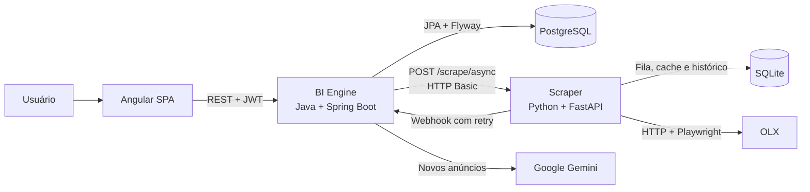

<p align="center">
  
</p>

<h1 align="center">Bobão do Oeste</h1>

<p align="center">
  <strong>Marketplace Intelligence Ecosystem</strong><br>
  Um caçador inteligente de oportunidades em marketplaces, com scraping resiliente, monitoramento recorrente e análise de hardware usado por inteligência artificial.
</p>

<p align="center">
  
</p>

O usuário cadastra um monitor com termos de busca, faixa de preço, frequência e critérios de análise. O sistema consulta o marketplace periodicamente, deduplica os anúncios, analisa os novos resultados com o Google Gemini e os disponibiliza em um painel web.

> **Estado do projeto:** MVP funcional voltado a uso interno. O fluxo completo está implementado para **OLX** com análise **SIMPLE**. Outros marketplaces, histórico de preços e notificações ainda fazem parte da evolução planejada.

## Sumário

- [Objetivo](#objetivo)
- [Identidade visual](#identidade-visual)
- [Arquitetura](#arquitetura)
- [Fluxo principal](#fluxo-principal)
- [Estrutura do monorepo](#estrutura-do-monorepo)
- [Tecnologias](#tecnologias)
- [Execução local](#execução-local)
- [Configuração](#configuração)
- [APIs e acessos](#apis-e-acessos)
- [Testes e qualidade](#testes-e-qualidade)
- [Deploy](#deploy)
- [Observabilidade](#observabilidade)
- [Segurança](#segurança)
- [Escopo atual e limitações](#escopo-atual-e-limitações)
- [Documentação técnica](#documentação-técnica)

## Objetivo

O projeto reduz o trabalho manual de repetir buscas e comparar anúncios de hardware usado. Seu núcleo funcional permite:

- Criar monitores associados a um usuário.
- Configurar palavras-chave, preço, marketplace e periodicidade.
- Executar uma coleta assim que o monitor é criado.
- Repetir buscas automaticamente por agendamento.
- Consolidar anúncios sem duplicá-los.
- Atualizar preço e última visualização de anúncios já conhecidos.
- Analisar novos anúncios com Gemini e gerar score, tier, resumo, destaques e ressalvas.
- Consultar monitores, anúncios, execuções, webhooks e auditorias de IA pela SPA.

Atualmente, o sistema funciona como um **monitor inteligente de anúncios**. A visão de longo prazo é evoluí-lo para inteligência de preços com histórico, tendências e alertas de oportunidade.

## Identidade visual

A identidade combina três conceitos centrais do produto: a precisão do hardware, a inteligência do robô e a linguagem de um caçador de recompensas do velho oeste. O resultado é uma marca de tecnologia com personalidade própria, construída sobre carvão, couro, latão e luz âmbar.

O emblema vetorial no topo é o símbolo principal da marca e também é usado como favicon da SPA. A cena do robô examinando a GPU funciona como imagem institucional porque comunica análise e descoberta sem competir com a leitura. Os demais estudos registram as duas direções narrativas da identidade:

<table>
  <tr>
    <td width="50%" align="center" valign="top">
      <br>
      <sub><strong>Caça de oportunidades.</strong> A direção mais cinematográfica, indicada para campanhas, onboarding e estados vazios.</sub>
    </td>
    <td width="50%" align="center" valign="top">
      <br>
      <sub><strong>Estudo de marca.</strong> Referência de acabamento, materiais, volumes e variações do emblema.</sub>
    </td>
  </tr>
</table>

A aplicação da marca deve permanecer concentrada no shell, login, onboarding e estados ilustrados. Tabelas, formulários e gráficos continuam orientados à legibilidade. A estratégia completa está documentada no [plano de redesign da SPA](docs/UI_UX_REDESIGN_PLAN.md).

## Arquitetura

O repositório é um monorepo poliglota com três aplicações independentes. A SPA utiliza apenas a API Java; o BI Engine concentra a regra de negócio e orquestra o scraper Python.



### Web SPA

Localização: [`apps/web/project-ui`](apps/web/project-ui)

Interface Angular com componentes standalone e rotas carregadas sob demanda. Ela oferece login, dashboard, CRUD de monitores, consulta de anúncios, eventos de webhook e logs de IA.

- Envia access token JWT nas chamadas protegidas.
- Renova o token e repete requisições concorrentes quando necessário.
- Consulta o status do scraper por meio do BI Engine.
- Pode receber a URL da API em runtime quando publicada com Docker/Nginx.

### BI Engine

Localização: [`services/bi-engine`](services/bi-engine)

Backend central da plataforma. É responsável por autenticação, ownership, persistência de negócio, agendamento, despacho das coletas, ingestão dos webhooks e análise dos anúncios.

Sua organização segue uma arquitetura em camadas pragmática:

```text
br.dev.bielsolosos.biscraper
├── api                 Controllers e mappers da API REST
├── core                Segurança, configuração, enums e exceções
├── domain
│   ├── users           Usuários, autenticação e refresh tokens
│   ├── monitoring      Monitores, anúncios, execuções e análises
│   └── ai              Auditoria das interações com IA
└── infrastructure      Propriedades e cliente HTTP do scraper
```

O PostgreSQL é a fonte de verdade dos dados de negócio. O schema é versionado pelo Flyway e validado pelo Hibernate durante a inicialização.

### Scraper

Localização: [`services/scraper`](services/scraper)

Serviço especializado em aquisição de dados, sem concentrar regras de negócio do produto. Para a OLX, ele tenta primeiro uma requisição HTTP com fingerprint de navegador e utiliza Playwright stealth como fallback em bloqueios.

- Expõe operações síncronas e assíncronas de scraping.
- Mantém uma fila persistente de jobs em SQLite.
- Recupera jobs interrompidos após reinicialização.
- Entrega resultados por webhook com retry exponencial e jitter.
- Mantém histórico operacional, deduplicação e caches de detalhes e imagens.
- Executa workers separados para scraping, webhooks e limpeza de cache.

O SQLite funciona simultaneamente como banco operacional, fila persistente e cache local. Não há RabbitMQ ou Kafka no desenho atual.

### Persistência

| Banco | Responsabilidade | Principais dados |
| :--- | :--- | :--- |
| PostgreSQL | Fonte de verdade do produto | Usuários, monitores, queries, anúncios, execuções, webhooks e logs de IA |
| SQLite | Estado operacional do scraper | Jobs, entregas, resultados locais, detalhes e imagens em cache |

## Fluxo principal

1. O usuário autentica-se em `POST /api/v1/auth/login` e recebe access e refresh tokens.
2. A SPA cria um `ProductMonitor` com uma ou mais queries.
3. O BI Engine persiste o monitor e publica um evento após o commit.
4. O dispatcher cria os registros de execução e webhook no PostgreSQL.
5. O BI Engine chama `POST /api/v1/scrape/async` no scraper usando HTTP Basic.
6. O scraper grava atomicamente o job e a futura entrega do webhook no SQLite e responde com HTTP `202`.
7. Um worker coleta e interpreta os anúncios da OLX.
8. Outro worker envia o resultado ao BI Engine, repetindo a entrega em falhas transitórias.
9. O BI Engine correlaciona o callback pelo `requestId`, atualiza anúncios conhecidos e separa anúncios novos.
10. A estratégia selecionada analisa os novos anúncios; no modo `SIMPLE`, o Gemini processa lotes de até 15 itens.
11. Os anúncios, scores e dados de auditoria ficam disponíveis para consulta na SPA.
12. Para recorrência, o scheduler do BI Engine verifica a cada minuto quais monitores ativos devem ser executados.

## Estrutura do monorepo

```text
.
├── apps/
│   └── web/
│       └── project-ui/          Angular SPA e imagem Nginx
├── services/
│   ├── bi-engine/               API e orquestração Java
│   └── scraper/                 Coleta e filas Python
│       └── docs/                Guias técnicos do scraper
├── .github/
│   └── workflows/               Pipelines independentes por módulo
├── docker-compose.yml           PostgreSQL e scraper para desenvolvimento
└── README.md
```

## Tecnologias

| Componente | Stack principal |
| :--- | :--- |
| Web | Angular 22, TypeScript 6, RxJS, Tailwind CSS 4, Vitest e Nginx |
| BI Engine | Java 21, Spring Boot 4.1.1, Spring MVC, Spring Security, JPA, Flyway, Spring AI e Maven |
| Scraper | Python 3.11+, FastAPI, Pydantic 2, SQLModel, aiosqlite, curl_cffi, Playwright e uv |
| Dados | PostgreSQL 16 e SQLite |
| Integrações | OLX, Google Gemini e webhooks HTTP |
| Entrega | Docker, Docker Compose e GitHub Actions |

## Execução local

### Pré-requisitos

- Docker com Docker Compose.
- JDK 21 para executar o BI Engine fora do container.
- Node.js 24 e npm 11 para executar a SPA.
- Uma chave do Google Gemini para habilitar a análise `SIMPLE`.
- Python 3.11+ e [uv](https://docs.astral.sh/uv/) somente se o scraper for executado fora do Docker.

### 1. Configurar o BI Engine

Crie `services/bi-engine/.env` a partir de [`services/bi-engine/.env.example`](services/bi-engine/.env.example). No mínimo, configure uma chave válida do Gemini:

```dotenv
GEMINI_API_KEY=your_gemini_api_key_here
```

Se o scraper for executado pelo Docker Desktop e o BI Engine diretamente no host, configure também um callback que seja alcançável de dentro do container:

```dotenv
SCRAPER_WEBHOOK_URL=http://host.docker.internal:8080/api/v1/webhooks/scraper
```

Ao executar ambos diretamente no host, mantenha `http://localhost:8080/api/v1/webhooks/scraper`. No Docker Engine para Linux, use um endereço do host alcançável pelo container ou configure o alias `host.docker.internal` antes de iniciar o fluxo assíncrono.

Para ambientes compartilhados ou produção, também substitua `JWT_SECRET`, as credenciais do banco e as credenciais de integração com o scraper.

### 2. Iniciar PostgreSQL e scraper

Na raiz do repositório:

```bash
docker compose up -d postgres scraper
docker compose ps
```

O Compose atual inicia apenas esses dois componentes. O BI Engine e a SPA devem ser executados separadamente nos passos seguintes.

### 3. Iniciar o BI Engine

Linux, macOS ou Git Bash:

```bash
cd services/bi-engine
./mvnw spring-boot:run
```

Windows PowerShell:

```powershell
Set-Location services/bi-engine
.\mvnw.cmd spring-boot:run
```

Na primeira inicialização, o Flyway cria o schema e o usuário administrativo de desenvolvimento.

### 4. Iniciar a SPA

Em outro terminal:

```bash
cd apps/web/project-ui
npm install
npm start
```

A aplicação estará disponível em [http://localhost:4200](http://localhost:4200).

### 5. Verificar os serviços

| Recurso | URL |
| :--- | :--- |
| SPA | [http://localhost:4200](http://localhost:4200) |
| BI Engine health | [http://localhost:8080/actuator/health](http://localhost:8080/actuator/health) |
| BI Engine Swagger | [http://localhost:8080/swagger-ui.html](http://localhost:8080/swagger-ui.html) |
| BI Engine OpenAPI | [http://localhost:8080/docs](http://localhost:8080/docs) |
| Scraper health | [http://localhost:8001/health](http://localhost:8001/health) |
| Scraper Swagger | [http://localhost:8001/docs](http://localhost:8001/docs) |
| Dashboard temporário do scraper | [http://localhost:8001/dashboard](http://localhost:8001/dashboard) |

### Credenciais de desenvolvimento

| Componente | Autenticação | Usuário | Senha |
| :--- | :--- | :--- | :--- |
| BI Engine e SPA | JWT após login | `admin` | `admin123` |
| Scraper | HTTP Basic | `admin` | `admin` |

Essas credenciais existem somente para desenvolvimento e devem ser alteradas antes de qualquer exposição da aplicação.

### Testar o login

```bash
curl --request POST http://localhost:8080/api/v1/auth/login \
  --header "Content-Type: application/json" \
  --data '{"username":"admin","password":"admin123"}'
```

### Executar o scraper sem Docker

Pare o container `scraper` antes de usar a mesma porta local:

```bash
docker compose stop scraper
cd services/scraper
uv sync
uv run playwright install chromium
uv run uvicorn src.main:app --host 0.0.0.0 --port 8001 --reload
```

As opções disponíveis estão em [`services/scraper/.env.example`](services/scraper/.env.example). O serviço carrega automaticamente um arquivo `.env` criado no diretório do módulo.

## Configuração

### BI Engine

Referência: [`services/bi-engine/.env.example`](services/bi-engine/.env.example)

| Variável | Finalidade | Padrão de desenvolvimento |
| :--- | :--- | :--- |
| `DB_URL` | URL JDBC do PostgreSQL | `jdbc:postgresql://localhost:5432/marketplace_bi` |
| `DB_USERNAME` | Usuário do PostgreSQL | `postgres` |
| `DB_PASSWORD` | Senha do PostgreSQL | `postgrespassword` |
| `PORT` | Porta HTTP do BI Engine | `8080` |
| `GEMINI_API_KEY` | Credencial da API Google Gemini | Sem valor seguro padrão |
| `GEMINI_MODEL` | Modelo usado na análise | Configurável pelo ambiente |
| `JWT_SECRET` | Chave de assinatura dos access tokens | Deve ser substituída fora do desenvolvimento |
| `CORS_ALLOWED_ORIGINS` | Origens autorizadas para a SPA | URLs locais separadas por vírgula |
| `SCRAPER_BASE_URL` | URL interna do scraper | `http://localhost:8001` |
| `SCRAPER_USERNAME` | Usuário HTTP Basic do scraper | `admin` |
| `SCRAPER_PASSWORD` | Senha HTTP Basic do scraper | `admin` |
| `SCRAPER_WEBHOOK_URL` | Callback acessível pelo scraper | `http://localhost:8080/api/v1/webhooks/scraper` |

### Scraper

Referência: [`services/scraper/.env.example`](services/scraper/.env.example)

| Variável | Finalidade | Padrão de desenvolvimento |
| :--- | :--- | :--- |
| `DATABASE_URL` | Banco operacional e filas | `sqlite+aiosqlite:///./data/scraper.db` |
| `BASIC_AUTH_USERNAME` | Usuário das rotas protegidas | `admin` |
| `BASIC_AUTH_PASSWORD` | Senha das rotas protegidas | `admin` |
| `ENABLE_PLAYWRIGHT_FALLBACK` | Ativa fallback de navegador | `true` |
| `SCRAPE_WORKER_CONCURRENCY` | Quantidade de coletas simultâneas | `1` |
| `SCRAPE_JOB_TIMEOUT_SECONDS` | Timeout de espera de um job | `300` |
| `WEBHOOK_DISPATCHER_CONCURRENCY` | Entregas simultâneas | `2` |
| `WEBHOOK_DELIVERY_MAX_ATTEMPTS` | Limite de tentativas por webhook | `5` |

### Web

Em desenvolvimento, a SPA utiliza `http://localhost:8080/api/v1`. Na imagem Docker, defina `API_URL` para injetar a URL do BI Engine em runtime:

```bash
docker build --tag marketplace-web apps/web/project-ui
docker run --rm --publish 3000:80 \
  --env API_URL=https://api.example.com/api/v1 \
  marketplace-web
```

## APIs e acessos

### BI Engine

As rotas de negócio exigem `Authorization: Bearer <token>`, salvo autenticação, documentação, healthcheck e callback do scraper.

| Método e rota | Finalidade |
| :--- | :--- |
| `POST /api/v1/auth/login` | Autenticação e emissão de tokens |
| `POST /api/v1/auth/refresh` | Renovação do access token |
| `GET /api/v1/me` | Perfil do usuário autenticado |
| `GET/POST /api/v1/product-monitors` | Listagem e criação de monitores |
| `GET/PUT/DELETE /api/v1/product-monitors/{id}` | Consulta, edição e remoção de um monitor |
| `PATCH /api/v1/product-monitors/{id}/activate` | Ativação de um monitor |
| `PATCH /api/v1/product-monitors/{id}/deactivate` | Pausa de um monitor |
| `GET /api/v1/product-monitors/{id}/listings` | Anúncios pertencentes ao monitor |
| `GET /api/v1/ai-logs` | Auditoria das análises de IA do usuário |
| `GET /api/v1/scraper/queue-status` | Proxy autenticado do estado das filas |
| `POST /api/v1/webhooks/scraper` | Callback interno dos resultados do scraper |

O contrato completo pode ser explorado pelo [Swagger do BI Engine](http://localhost:8080/swagger-ui.html).

### Scraper

Todas as rotas sob `/api/v1` exigem HTTP Basic.

| Método e rota | Finalidade |
| :--- | :--- |
| `POST /api/v1/scrape` | Enfileira uma coleta e aguarda o resultado |
| `POST /api/v1/scrape/async` | Enfileira e retorna `202`; o resultado segue por webhook |
| `POST /api/v1/scrape/detail` | Extrai detalhes de uma URL de anúncio |
| `GET /api/v1/scrape/images/{id}` | Recupera uma imagem armazenada no cache |
| `GET /api/v1/listings` | Consulta anúncios no banco operacional |
| `GET /api/v1/executions` | Consulta histórico e telemetria das execuções |
| `GET /api/v1/queue/status` | Consulta contadores de jobs e webhooks |
| `GET /api/v1/webhooks/{requestId}` | Consulta o estado de uma entrega |
| `GET /health` | Healthcheck público |

## Testes e qualidade

### BI Engine

```bash
cd services/bi-engine
./mvnw clean verify
```

No Windows, use `.\mvnw.cmd clean verify`.

### Scraper

```bash
cd services/scraper
uv sync --all-extras --dev
uv run ruff format --check .
uv run ruff check .
uv run pyright src/ tests/
uv run pytest --cov=src
```

### Web

```bash
cd apps/web/project-ui
npm test
npm run build
```

Os workflows em [`.github/workflows`](.github/workflows) executam verificações independentes por módulo. O BI Engine e o scraper passam por build, testes e validação das imagens Docker; o frontend passa por build da aplicação e da imagem.

## Deploy

Os três módulos possuem Dockerfiles próprios e podem ser publicados de forma independente:

- O scraper pode operar próximo à origem da coleta, inclusive em um Raspberry Pi ou host com IP residencial.
- O BI Engine pode ser publicado em uma VPS com acesso ao PostgreSQL e ao Gemini.
- A SPA é compilada como arquivos estáticos e servida pelo Nginx; não utiliza SSR.
- O endereço de webhook configurado no BI Engine precisa ser alcançável pelo scraper.
- O endereço do scraper precisa ser alcançável pelo BI Engine.

O [`docker-compose.yml`](docker-compose.yml) atual é voltado ao desenvolvimento e contém apenas PostgreSQL e scraper ativos. Os blocos antigos de BI Engine e web permanecem como scaffold e ainda precisam ser atualizados antes de habilitar uma stack completa por Compose.

## Observabilidade

A stack de observabilidade utiliza Prometheus e Loki no Grafana Cloud, com Grafana Alloy como coletor. No ambiente atual, o scraper roda diretamente no Raspberry sob supervisão do PM2, enquanto o BI Engine roda em container no Coolify/VPS.

| Origem | Métricas | Logs |
| :--- | :--- | :--- |
| Scraper | HTTP em `/metrics` e processos Python/Chromium pelo process exporter | JSON nos arquivos gerenciados pelo PM2 |
| Raspberry | CPU, memória, swap, disco, temperatura, pressure e OOM pelo unix exporter | Journal do kernel |
| BI Engine | Spring Actuator em `/actuator/prometheus` | JSON no stdout do container |

### Scraper no PM2

O PM2 é o único supervisor do scraper; não é necessário criar uma unit systemd adicional. A configuração versionada mantém o nome real `scrap`, necessário para o Alloy localizar `~/.pm2/logs/scrap-out.log` e `scrap-error.log`:

```bash
cd services/scraper
uv sync
pm2 start ecosystem.config.cjs
pm2 save
```

Depois de atualizar o código ou as dependências:

```bash
pm2 reload ecosystem.config.cjs --update-env
pm2 save
```

### Alloy no Raspberry

O arquivo [`deploy/observability/raspberry-host-and-logs.alloy`](deploy/observability/raspberry-host-and-logs.alloy) complementa a configuração gerada pelo Grafana Cloud. Ele espera que `/etc/alloy/config.alloy` já contenha os componentes `prometheus.remote_write.metrics_service` e `loki.write.grafana_cloud_loki`.

Após conceder ao usuário `alloy` acesso de leitura aos logs do PM2, anexe o snippet ao arquivo principal e valide a configuração:

```bash
sudo alloy validate /etc/alloy/config.alloy
sudo systemctl restart alloy
sudo systemctl status alloy
```

As ACLs necessárias e o procedimento completo estão no [guia de observabilidade do Raspberry](docs/OBSERVABILITY_RASPBERRY.md). Credenciais do Grafana Cloud não devem ser adicionadas ao repositório.

### Dashboard e consultas

Importe as dashboards no Grafana e selecione o data source Prometheus solicitado durante a importação:

- [`docs/grafana/observability-test-dashboard.json`](docs/grafana/observability-test-dashboard.json): visão geral de HTTP, Python, JVM, PostgreSQL, Raspberry e processos.
- [`docs/grafana/spring-ai-and-boot-dashboard.json`](docs/grafana/spring-ai-and-boot-dashboard.json): tokens, chamadas, latência, ferramentas do Spring AI e métricas automáticas adicionais do Spring Boot.

As séries `gen_ai_*` somente aparecem depois que ao menos uma chamada real ao Gemini termina. O Micrometer contabiliza tokens de entrada, saída e total, mas não calcula custo financeiro; isso exige aplicar externamente a tabela de preços do modelo.

Exemplos de consultas:

```promql
namedprocess_namegroup_memory_bytes{service="scraper-process",groupname="scraper",memtype="resident"}
```

```promql
increase(node_vmstat_oom_kill{service="raspberry-host"}[1h])
```

```logql
{application="projeto-scrap", service="scraper", level="ERROR"} | json
```

```logql
{application="infrastructure", service="kernel"} |~ "(?i)(out of memory|oom|killed process)"
```

O Alloy do Raspberry consegue coletar o endpoint HTTP do BI Engine, mas não acessa os logs nem as métricas do container remoto. Para observar os logs do container Java, execute outro Alloy na VPS do Coolify com [`deploy/observability/coolify-docker-logs.alloy`](deploy/observability/coolify-docker-logs.alloy). CPU, memória total e OOM do container também precisam ser coletados nessa VPS.

> **TODO:** substituir o Grafana Cloud por uma stack de observabilidade self-hosted e totalmente open source. O Grafana Cloud permanece como a solução provisória encontrada para atender às necessidades atuais de métricas, logs e dashboards.

## Segurança

Controles já implementados:

- JWT assinado para a API do BI Engine.
- Refresh tokens opacos e de uso único.
- Senhas de usuários armazenadas com BCrypt.
- Validação de ownership dos monitores, anúncios e logs de IA.
- HTTP Basic com comparação constante nas rotas do scraper.

Antes de um deploy de produção:

- Troque todas as credenciais e segredos padrão.
- Forneça chaves apenas por variáveis de ambiente ou secret manager.
- Publique os serviços atrás de HTTPS e restrinja a comunicação interna por rede ou firewall.
- Adicione assinatura HMAC ou autenticação equivalente ao callback de webhook.
- Restrinja as URLs de callback aceitas pelo scraper para mitigar SSRF.
- Revise a exposição de `/api/v1/webhooks/**`, atualmente liberada no BI Engine.
- Defina backups e políticas de retenção para PostgreSQL e SQLite.

## Escopo atual e limitações

| Capacidade | Estado atual |
| :--- | :--- |
| Fluxo monitor → scraper → webhook → PostgreSQL | Implementado |
| Coleta OLX com fallback Playwright | Implementado |
| Filas persistentes e retry de webhook | Implementado |
| Análise Gemini `SIMPLE` e auditoria | Implementado |
| CRUD, dashboard e consultas paginadas | Implementado |
| Deep scraping e cache de imagens | Implementado no scraper, ainda sem integração com BI Engine/SPA |
| Mercado Livre e Enjoei | Presentes em partes do contrato/UI, sem providers funcionais |
| Análise especializada `NOTEBOOK` | Contrato e formulário parciais; sem estratégia de análise implementada |
| Histórico e tendências de preço | Não implementado; o preço atual é atualizado no anúncio |
| Alertas por e-mail, push ou mensageria | Não implementado |
| Stack completa no Docker Compose | Não implementada |
| Autenticação e assinatura de webhooks | Pendente de endurecimento |

O SQLite atende ao MVP e oferece recuperação simples de filas, mas não substitui um broker distribuído caso o scraper precise escalar horizontalmente. Da mesma forma, o scheduler do BI Engine não possui lock distribuído para múltiplas réplicas.

## Documentação técnica

- [Plano de identidade visual e redesign da SPA](docs/UI_UX_REDESIGN_PLAN.md)
- [README do BI Engine](services/bi-engine/README.md)
- [README do scraper](services/scraper/README.md)
- [README da SPA](apps/web/project-ui/README.md)
- [Observabilidade com Grafana Cloud, Alloy, Prometheus e Loki](docs/OBSERVABILITY_RASPBERRY.md)
- [Scraping e anti-detecção](services/scraper/docs/SCRAPING_GUIDE.md)
- [Fila de execução e workers](services/scraper/docs/QUEUE_GUIDE.md)
- [Entrega de webhooks](services/scraper/docs/WEBHOOK_GUIDE.md)
- [Deep scraping e cache de imagens](services/scraper/docs/DETAIL_AND_IMAGE_CACHE_GUIDE.md)
