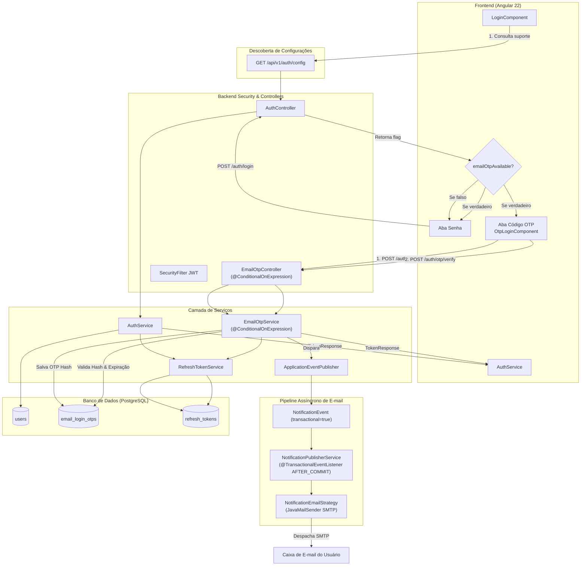

# Arquitetura e Implementação de Autenticação Híbrida (Senha + OTP por E-mail)

Este documento descreve detalhadamente o funcionamento, arquitetura de software, modelo de dados e implementação em código do sistema de autenticação híbrida (Senha tradicional + Passwordless/MFA por código OTP via e-mail) desenvolvido para a plataforma Bobão do Oeste (`bi-engine` e `project-ui`).

Este guia foi elaborado para servir como **padrão de referência** reutilizável em outros projetos e microsserviços do ecossistema.

---

## 1. Visão Geral da Arquitetura

O sistema adota uma abordagem de **autenticação híbrida desacoplada e configurável**:
1. **Modo Tradicional:** Usuário e Senha validados com BCrypt.
2. **Modo Passwordless (OTP por E-mail):** Código de uso único de 6 dígitos gerado com `SecureRandom`, persistido em banco na forma de **hash criptográfico**, com tempo de expiração, limite de tentativas e controle anti-spam (cooldown).
3. **Desacoplamento por Variáveis de Ambiente:** Os endpoints e beans de OTP só existem no runtime se explicitamente ativados via variáveis de ambiente (`@ConditionalOnExpression`).
4. **Envio de E-mail Assíncrono via Eventos:** O e-mail de autenticação é despachado através de `NotificationEvent` com flag `transactional: true`, garantindo execução pós-commit em thread assíncrona desacoplada e sem bloqueio por preferências de marketing do usuário.
5. **Emissão de Tokens JWT:** Ambos os métodos convergem para o mesmo contrato de resposta (`TokenResponse`), retornando um **Access Token JWT** stateless de curta duração e um **Refresh Token** de longa duração persistido no banco de dados.



---

## 2. Modelo de Dados (Flyway & JPA)

### 2.1. Tabela de Usuários e Tokens
- `users`: Armazena identidade principal (`id` UUID, `username`, `email`, `password` hash BCrypt, `is_active`).
- `user_roles` e `roles`: Associação Many-to-Many contendo papéis (`ROLE_USER`, `ROLE_ADMIN`).
- `refresh_tokens`: Armazena tokens de renovação vinculados ao usuário, com data de expiração e status revogado.

### 2.2. Tabela de Códigos OTP (`email_login_otps`)
Criada na migration [`V9__create_email_login_otps.sql`](../services/bi-engine/src/main/resources/db/migration/V9__create_email_login_otps.sql):

```sql
CREATE TABLE IF NOT EXISTS email_login_otps (
    id UUID PRIMARY KEY DEFAULT gen_random_uuid(),
    user_id UUID NOT NULL REFERENCES users(id) ON DELETE CASCADE,
    code_hash VARCHAR(255) NOT NULL,
    expires_at TIMESTAMP WITH TIME ZONE NOT NULL,
    attempts INTEGER NOT NULL DEFAULT 0,
    used BOOLEAN NOT NULL DEFAULT FALSE,
    created_at TIMESTAMP WITH TIME ZONE NOT NULL DEFAULT NOW()
);

CREATE INDEX IF NOT EXISTS idx_email_login_otps_user_id ON email_login_otps(user_id);
CREATE INDEX IF NOT EXISTS idx_email_login_otps_expires_at ON email_login_otps(expires_at);
CREATE INDEX IF NOT EXISTS idx_email_login_otps_user_used ON email_login_otps(user_id, used);
```

#### Entidade JPA:
[`EmailLoginOtp.java`](../services/bi-engine/src/main/java/br/dev/bielsolosos/biscraper/domain/users/model/EmailLoginOtp.java):
```java
@Getter
@Setter
@NoArgsConstructor
@AllArgsConstructor
@Builder
@Entity
@Table(name = "email_login_otps")
public class EmailLoginOtp {

    @Id
    @UuidGenerator
    @Column(updatable = false, nullable = false)
    private UUID id;

    @ManyToOne(fetch = FetchType.LAZY, optional = false)
    @JoinColumn(name = "user_id", nullable = false)
    private User user;

    @Column(name = "code_hash", nullable = false)
    private String codeHash; // Hash BCrypt do código gerado

    @Column(name = "expires_at", nullable = false)
    private Instant expiresAt;

    @Builder.Default
    @Column(nullable = false)
    private int attempts = 0;

    @Builder.Default
    @Column(nullable = false)
    private boolean used = false;

    @CreationTimestamp
    @Column(name = "created_at", nullable = false, updatable = false)
    private Instant createdAt;
}
```

> [!IMPORTANT]
> **Segurança de Código em Repouso:** O código OTP de 6 dígitos **nunca** é salvo em texto puro no banco de dados. Ele é hasheado com `passwordEncoder.encode(code)`. Caso o banco de dados sofra vazamento, os códigos de acesso ativos permanecem indecifráveis.

---

## 3. Mapeamento de Propriedades e Feature Flags

No [`BiScraperProperties.java`](../services/bi-engine/src/main/java/br/dev/bielsolosos/biscraper/infrastructure/BiScraperProperties.java):

```java
@Data
public static class Auth {
    private Otp otp = new Otp();

    @Data
    public static class Otp {
        private boolean enabled = false;
        private int expirationMinutes = 10;
        private int maxAttempts = 5;
        private int cooldownSeconds = 60;
    }
}
```

No [`application.yml`](../services/bi-engine/src/main/resources/application.yml):
```yaml
biscraper:
  email:
    enabled: ${EMAIL_ENABLED:false}
    from: ${EMAIL_FROM:Bobão do Oeste <no-reply@bielsolosos.dev.br>}
  auth:
    otp:
      enabled: ${AUTH_EMAIL_OTP_ENABLED:false}
      expiration-minutes: ${AUTH_EMAIL_OTP_EXPIRATION_MINUTES:10}
      max-attempts: ${AUTH_EMAIL_OTP_MAX_ATTEMPTS:5}
      cooldown-seconds: ${AUTH_EMAIL_OTP_COOLDOWN_SECONDS:60}
```

---

## 4. Condicionalidade de Endpoints (`@ConditionalOnExpression`)

Para garantir que o subsistema de OTP sequer exista em memória ou na tabela de rotas do Spring quando desativado:

### 4.1. Controller Dedicado: [`EmailOtpController.java`](../services/bi-engine/src/main/java/br/dev/bielsolosos/biscraper/api/controller/auth/EmailOtpController.java)
```java
@Slf4j
@RestController
@RequestMapping("/api/v1/auth/otp")
@RequiredArgsConstructor
@Tag(name = "Auth OTP", description = "Endpoints de autenticação Passwordless via código OTP por e-mail")
@ConditionalOnExpression("${biscraper.auth.otp.enabled:false} and ${biscraper.email.enabled:false}")
public class EmailOtpController {

    private final EmailOtpService emailOtpService;

    @PostMapping("/send")
    public ResponseEntity<SendOtpResponse> sendOtp(@Valid @RequestBody SendOtpRequest request) {
        return ResponseEntity.ok(emailOtpService.sendOtp(request));
    }

    @PostMapping("/verify")
    public ResponseEntity<TokenResponse> verifyOtp(@Valid @RequestBody VerifyOtpRequest request) {
        return ResponseEntity.ok(emailOtpService.verifyOtp(request));
    }
}
```

### 4.2. Serviço Dedicado: [`EmailOtpService.java`](../services/bi-engine/src/main/java/br/dev/bielsolosos/biscraper/domain/users/service/EmailOtpService.java)
```java
@Slf4j
@Service
@RequiredArgsConstructor
@ConditionalOnExpression("${biscraper.auth.otp.enabled:false} and ${biscraper.email.enabled:false}")
public class EmailOtpService {
    ...
}
```

### 4.3. Controller Principal Desacoplado: [`AuthController.java`](../services/bi-engine/src/main/java/br/dev/bielsolosos/biscraper/api/controller/auth/AuthController.java)
O `AuthController` **não injeta `EmailOtpService`**, evitando quebra de injeção de dependência quando a feature estiver desligada. Ele injeta apenas `BiScraperProperties`:
```java
@GetMapping("/config")
public ResponseEntity<AuthConfigResponse> getAuthConfig() {
    boolean emailOtpEnabled = properties.getAuth().getOtp().isEnabled() && properties.getEmail().isEnabled();
    return ResponseEntity.ok(new AuthConfigResponse(emailOtpEnabled));
}
```

---

## 5. Pipeline Assíncrono de Notificação e E-mails Transacionais

Para seguir o padrão do [`AGENTS.md`](../AGENTS.md) de nunca realizar operações pesadas (I/O de rede/SMTP) na thread HTTP:

### 5.1. Flag Transacional no Evento
No [`NotificationEvent.java`](../services/bi-engine/src/main/java/br/dev/bielsolosos/biscraper/domain/notification/event/NotificationEvent.java):
```java
@Data
@Builder
@AllArgsConstructor
@NoArgsConstructor
public class NotificationEvent {
    private User recipient;
    private NotificationTemplate contentTemplate;
    private Map<String, Object> items;
    private boolean transactional; // Bypass de preferências de anúncios
}
```

### 5.2. Bypass de Preferências na Estratégia de E-mail
No [`NotificationEmailStrategy.java`](../services/bi-engine/src/main/java/br/dev/bielsolosos/biscraper/domain/notification/strategy/impl/NotificationEmailStrategy.java):
```java
if (!properties.getEmail().isEnabled()) {
    log.info("Notificações por e-mail estão desativadas globalmente.");
    return;
}

// Eventos transacionais (ex: códigos de login / MFA) ignoram o bloqueio de anúncios
if (!event.isTransactional()) {
    Optional<UserConfig> configOpt = userConfigRepository.findByUserId(recipient.getId());
    if (configOpt.isEmpty() || !configOpt.get().isEmailEnabled()) {
        log.info("Notificações por e-mail desativadas para o usuário '{}'", recipient.getUsername());
        return;
    }
}

// Despacha via JavaMailSender (MimeMessage UTF-8 HTML)
sendViaSmtp(recipient.getEmail(), subject, html, text);
```

### 5.3. Template de E-mail OTP
Em [`EmailOtpNotificationTemplate.java`](../services/bi-engine/src/main/java/br/dev/bielsolosos/biscraper/domain/users/notification/EmailOtpNotificationTemplate.java):
- Implementa `NotificationTemplate`.
- Retorna `NotificationChannel.EMAIL`.
- Gera HTML responsivo com a identidade visual da marca e o código de 6 dígitos em fonte monospace com grande destaque.

### 5.4. Publicação Desacoplada no `EmailOtpService`
```java
EmailOtpNotificationTemplate template = new EmailOtpNotificationTemplate(user, code, expirationMinutes);
NotificationEvent event = NotificationEvent.builder()
        .recipient(user)
        .contentTemplate(template)
        .transactional(true)
        .build();

eventPublisher.publishEvent(event);
```
O listener [`NotificationPublisherService`](../services/bi-engine/src/main/java/br/dev/bielsolosos/biscraper/domain/notification/service/NotificationPublisherService.java) intercepta o evento com `@TransactionalEventListener(phase = TransactionPhase.AFTER_COMMIT, fallbackExecution = true)` e `@Async("notificationDispatcherExecutor")`, garantindo que:
1. O banco já comitou o OTP com sucesso antes de despachar o e-mail.
2. A resposta HTTP da API retorna instantaneamente para o frontend sem aguardar a latência do servidor SMTP.

---

## 6. Lógica de Negócio do OTP (`EmailOtpService`)

### 6.1. Geração e Envio (`sendOtp`)
1. **Identificação Flexível:** Aceita tanto `username` quanto `email`.
2. **Checagem de Usuário:** Verifica se o usuário existe, se possui e-mail válido e se a conta está ativa.
3. **Controle Anti-Spam (Cooldown):**
   ```java
   Optional<EmailLoginOtp> lastOtp = otpRepository.findTopByUserIdAndUsedFalseOrderByCreatedAtDesc(user.getId());
   if (lastOtp.isPresent()) {
       long elapsedSeconds = Duration.between(lastOtp.get().getCreatedAt(), Instant.now()).getSeconds();
       int cooldown = properties.getAuth().getOtp().getCooldownSeconds();
       if (elapsedSeconds < cooldown) {
           long remaining = cooldown - elapsedSeconds;
           throw new BusinessException("Aguarde " + remaining + " segundos antes de solicitar um novo código.");
       }
   }
   ```
4. **Geração Criptográfica:** Gera 6 dígitos via `SecureRandom` (`100000 + secureRandom.nextInt(900000)`).
5. **Persistência do Hash:** Salva entidade com `codeHash = passwordEncoder.encode(code)`.

### 6.2. Verificação e Emissão de Tokens (`verifyOtp`)
1. **Busca do Código Mais Recente:** Recupera o último registro não utilizado (`used = false`).
2. **Validação de Expiração:**
   ```java
   if (otp.getExpiresAt().isBefore(Instant.now())) {
       otp.setUsed(true);
       otpRepository.save(otp);
       throw new BusinessException("O código de acesso expirou. Solicite um novo.");
   }
   ```
3. **Controle de Tentativas (Brute-force protection):**
   - Se atingir o limite (`maxAttempts`, ex: 5), invalida o OTP (`used = true`) e bloqueia.
   - Em caso de código incorreto, incrementa `attempts++` e informa tentativas restantes.
4. **Sucesso:**
   - Marca o código como consumido (`otp.setUsed(true)`).
   - Emite o Access Token JWT (`jwtUtil.generateToken(username)`) e o Refresh Token persistido.

---

## 7. Implementação no Frontend (Angular 22 Standalone)

A arquitetura no frontend foi dividida em componentes modulares e desacoplados:

### 7.1. Camada de Serviço: [`AuthService.ts`](../apps/web/project-ui/src/app/core/services/auth.service.ts)
Gerencia autenticação através de Angular Signals:
- `isAuthenticated = signal<boolean>(this.hasToken())`
- `currentUser = signal<UserResponse | null>(null)`
- Métodos:
  - `getAuthConfig()`: Consulta `/api/v1/auth/config`.
  - `login(credentials)`: Post `/api/v1/auth/login`.
  - `sendOtp({ identifier })`: Post `/api/v1/auth/otp/send`.
  - `verifyOtp({ identifier, code })`: Post `/api/v1/auth/otp/verify`.
  - `handleAuthSuccess(...)`: Salva tokens no `localStorage`, atualiza `isAuthenticated` e dispara `loadMe()`.

### 7.2. Tela de Login: [`LoginComponent`](../apps/web/project-ui/src/app/features/auth/login/login.component.ts) e [`login.component.html`](../apps/web/project-ui/src/app/features/auth/login/login.component.html)
- Consulta `getAuthConfig()` no `ngOnInit`.
- Se `emailOtpEnabled` for `false`: exibe exclusivamente o formulário tradicional por senha.
- Se for `true`: exibe um seletor visual em abas (`Com Senha` vs `Código por E-mail`).
- Sincronização inteligente: Se o usuário preencher o campo de usuário na aba de senha e alternar para a aba OTP, o identificador é copiado automaticamente.

### 7.3. Subcomponente Especializado: [`OtpLoginComponent`](../apps/web/project-ui/src/app/features/auth/login/components/otp-login/otp-login.component.ts)
- Isolado em subpasta `components/otp-login/`.
- **Etapa 1:** Input de usuário/e-mail com validação e loading.
- **Etapa 2:** Input de 6 dígitos numéricos estilizado (`font-mono text-2xl tracking-[0.4em]`).
- **Timer de Cooldown:** Contador regressivo de 60 segundos com botão de reenvio que se reativa após o término.
- Limpeza de temporizadores no `ngOnDestroy`.

---

## 8. Guia para Replicação em Novos Projetos

Para replicar essa mesma autenticação em outros projetos backend/frontend:

1. **Dependências Necessárias:**
   - Backend: `spring-boot-starter-security`, `spring-boot-starter-mail`, `jjwt` (ou `java-jwt`), `flyway-core`.
   - Frontend: `@angular/forms`, `rxjs`.
2. **Passo a Passo de Criação:**
   - [ ] Criar a tabela `email_login_otps` via migração do banco.
   - [ ] Criar a entidade JPA `EmailLoginOtp` com hash BCrypt para o código.
   - [ ] Criar o DTO `AuthConfigResponse` e expor `GET /api/v1/auth/config`.
   - [ ] Isolar `EmailOtpController` e `EmailOtpService` com anotação `@ConditionalOnExpression`.
   - [ ] Criar template de e-mail e integrar com publicação de eventos assíncronos (`@TransactionalEventListener(phase = AFTER_COMMIT)`).
   - [ ] No frontend, adicionar o seletor condicional de abas e o componente de digitação de OTP de 6 dígitos com cooldown.
