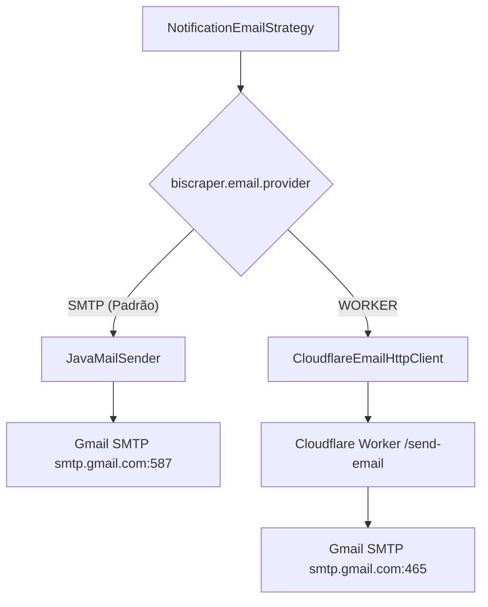

# 🔔 Sistema de Notificações — BI Scraper

Este documento descreve a arquitetura, padrões de projeto, canais suportados, agendamentos periódicos e guia operacional do **Sistema de Notificações** do ecossistema BI Scraper.

---

## 1. Visão Geral da Arquitetura

O sistema de notificações adota o **Strategy Pattern**, desacoplamento por eventos Spring (`@EventListener` assíncrono via `NotificationPublisherService`) e polimorfismo de templates de domínio (`NotificationTemplate`).

```
                              ┌────────────────────────────────────────┐
                              │           Scraping Ingestion           │
                              │     (WebhookScrapperService / AI)      │
                              └──────────────────┬─────────────────────┘
                                                 │
                                                 ▼
                              ┌────────────────────────────────────────┐
                              │      Spring NotificationEvent          │
                              └──────────────────┬─────────────────────┘
                                                 │
                                                 ▼
┌────────────────────────────────────────────────────────────────────────────────────────┐
│ NotificationPublisherService (Core Orchestrator)                                      │
│  - Resolve canais habilitados no UserConfig (DISCORD, EMAIL)                          │
│  - Delega para NotificationStrategySelector                                           │
└───────────────────────┬────────────────────────────────────────┬───────────────────────┘
                        │                                        │
                        ▼                                        ▼
      ┌───────────────────────────────────┐    ┌───────────────────────────────────┐
      │     NotificationDiscordStrategy   │    │      NotificationEmailStrategy    │
      │  (Tempo Real / Webhook Discord)   │    │   (Digest 4x/dia + Tempo Real)    │
      └─────────────────┬─────────────────┘    └─────────────────┬─────────────────┘
                        │                                        │
                        ▼                                        ├──► Provedor: SMTP (JavaMailSender)
             [ Discord Webhook API ]                             │
                                                                 └──► Provedor: WORKER (Cloudflare Worker)
                                                                             │
                                                                             ▼
                                                                  [ Cloudflare Email Worker ]
                                                                  (services/email-worker)
                                                                             │
                                                                             ▼
                                                                  [ Gmail SMTP / Recipient ]
```

### 1.1. Componentes Principais

| Componente | Pacote | Responsabilidade |
|---|---|---|
| `NotificationEvent` | `core.utils` | Objeto de evento imutável contendo `recipient` e `template`. |
| `NotificationTemplate` | `core.utils` | Interface base com métodos polimórficos (`toDiscordPayload()`, `toHtmlEmail()`, `getMessageTemplate()`). |
| `NotificationPublisherService` | `domain.notification.service` | Ouve `NotificationEvent` e despacha para cada canal ativo do usuário. |
| `NotificationStrategySelector` | `domain.notification.strategy` | Roteador de estratégias injetadas pelo Spring (`Map<NotificationChannel, NotificationStrategy>`). |
| `NotificationDiscordStrategy` | `domain.notification.strategy.impl` | Formata e envia webhooks para o Discord com embeds ricos. |
| `NotificationEmailStrategy` | `domain.notification.strategy.impl` | Envia e-mails HTML responsivos usando **SMTP direto** ou **Cloudflare Worker**. |
| `MonitoringEmailDigestService` | `domain.monitoring.service` | Serviço de domínio que agrega oportunidades `HIGH` match e publica o digest. |
| `EmailDigestScheduler` | `infrastructure.scheduling` | Trigger/Cronjob agendado (4x/dia) na camada de infraestrutura que delega ao serviço de domínio. |
| `CloudflareEmailHttpClient` | `infrastructure.client.email` | Cliente HTTP (RestClient) seguro para delegar disparos ao Cloudflare Worker. |

---

## 2. Canal Discord (Alertas em Tempo Real)

### 2.1. Funcionamento
Quando um anúncio com tier `HIGH` é identificado durante o processo de scraping e análise por IA, o `WebhookScrapperService` dispara um `NotificationEvent` com o template `MonitoringListingNotificationTemplate`.

### 2.2. Payload do Webhook
O template formata um embed rico contendo:
- **Título & Link:** Link direto para a listagem no marketplace.
- **Preço & Economia:** Valor formatado em BRL e comparação com faixa esperada.
- **Score de Match:** Porcentagem calculada pelo algoritmo/IA com badge colorido.
- **Origem & Localização:** Cidade, Estado e indicador de entrega/frete.
- **Thumbnail:** Imagem principal do produto diretamente no Discord.

### 2.3. Configuração do Usuário
Configurado em `user_configs`:
- `discord_enabled` (`BOOLEAN`): Liga/desliga notificações do Discord.
- `discord_webhook_url` (`VARCHAR`): URL do canal do Discord (ex: `https://discord.com/api/webhooks/...`).

---

## 3. Canal E-mail (Digest Periódico & Híbrido)

### 3.1. Digest Periódico 4x ao Dia
O agendador `EmailDigestScheduler` (delegando ao serviço de domínio `MonitoringEmailDigestService`) executa 4 vezes ao dia nos seguintes horários de pico comercial:
- **08:00** (Manhã)
- **12:00** (Almoço)
- **16:00** (Tarde)
- **20:00** (Noite)

**Regras de Negócio do Digest:**
1. Itera sobre todos os usuários que possuem `email_enabled = true` em `user_configs`.
2. Busca listagens no repositório com `matchTier = MatchTier.HIGH` criadas nas **últimas 4 horas** (`createdAt >= now - 4h`).
3. **Zero Spam:** Se nenhuma listagem `HIGH` match for encontrada na janela de 4 horas, o envio do e-mail é automaticamente ignorado.
4. Gera um template HTML moderno e responsivo (`MonitoringEmailDigestNotificationTemplate`) e publica o `NotificationEvent`.

### 3.2. Arquitetura Híbrida de Envio (Dual Provider)

A service `NotificationEmailStrategy` suporta dois provedores de entrega alternáveis via configuração (`biscraper.email.provider`):



#### Modo 1: `SMTP` (JavaMailSender Nativo)
- Envia diretamente da aplicação Java via `spring-boot-starter-mail`.
- Utiliza conexão TLS com `smtp.gmail.com:587`.
- Ideal para deploys tradicionais, containers Docker ou VPS.

#### Modo 2: `WORKER` (Cloudflare Worker Serverless)
- O backend delega o envio via requisição HTTP `POST /send-email` para uma Cloudflare Worker em `services/email-worker`.
- Protegido por Token de Autenticação (`x-auth-token` / `AUTH_SECRET`).
- Permite isolar o tráfego de e-mails em edge serverless com IP/infraestrutura independente.

---

## 4. Cloudflare Worker (`services/email-worker`)

O microsserviço serverless está localizado em `services/email-worker`.

### 4.1. Endpoints

#### `POST /send-email`
Envia um e-mail formatado via Nodemailer conectado ao Gmail SMTP.

**Headers:**
```http
Content-Type: application/json
x-auth-token: <AUTH_SECRET>
```

**Request Body:**
```json
{
  "to": "destinatario@exemplo.com",
  "subject": "🎯 BI Scraper: 2 novas oportunidades HIGH match",
  "html": "<!DOCTYPE html><html>...</html>",
  "text": "Versão em texto puro (fallback)"
}
```

**Response (200 OK):**
```json
{
  "success": true,
  "messageId": "<c2a0-4f9e@gmail.com>",
  "message": "Email sent successfully"
}
```

#### `GET /health`
Verifica a saúde do worker e conectividade.

---

### 4.2. Deploy do Worker no Cloudflare

1. Navegue até a pasta do worker:
   ```bash
   cd services/email-worker
   npm install
   ```

2. Configure os Secrets no Cloudflare:
   ```bash
   npx wrangler secret put SMTP_USER      # Ex: fatiarapidaautomation@gmail.com
   npx wrangler secret put SMTP_PASS      # App Password de 16 caracteres do Gmail
   npx wrangler secret put AUTH_SECRET    # Token seguro compartilhado com o bi-engine
   ```

3. Realize o deploy:
   ```bash
   npm run deploy
   ```

---

## 5. Configuração & Variáveis de Ambiente

### 5.1. Configuração no `application.yml` (`services/bi-engine`)

```yaml
spring:
  mail:
    host: ${SPRING_MAIL_HOST:smtp.gmail.com}
    port: ${SPRING_MAIL_PORT:587}
    username: ${SPRING_MAIL_USERNAME:fatiarapidaautomation@gmail.com}
    password: ${SPRING_MAIL_PASSWORD:}
    properties:
      mail:
        smtp:
          auth: true
          starttls:
            enable: true

biscraper:
  email:
    provider: ${BISCRAPER_EMAIL_PROVIDER:SMTP} # Opções: SMTP ou WORKER
    from: ${BISCRAPER_EMAIL_FROM:fatiarapidaautomation@gmail.com}
    worker-url: ${BISCRAPER_EMAIL_WORKER_URL:https://bi-scraper-email-worker.workers.dev}
    worker-auth-token: ${BISCRAPER_EMAIL_WORKER_AUTH_TOKEN:}
    digest-cron: "${BISCRAPER_EMAIL_DIGEST_CRON:0 0 8,12,16,20 * * *}"
    digest-window-hours: ${BISCRAPER_EMAIL_DIGEST_WINDOW_HOURS:4}
```

### 5.2. Tabela de Variáveis de Ambiente

| Variável | Padrão | Descrição |
|---|---|---|
| `SPRING_MAIL_HOST` | `smtp.gmail.com` | Host SMTP para envio direto. |
| `SPRING_MAIL_PORT` | `587` | Porta SMTP com STARTTLS. |
| `SPRING_MAIL_USERNAME` | `fatiarapidaautomation@gmail.com` | Usuário/E-mail do remetente Gmail. |
| `SPRING_MAIL_PASSWORD` | *(vazio)* | Senha de App do Gmail (16 dígitos). |
| `BISCRAPER_EMAIL_PROVIDER` | `SMTP` | Provedor de despacho (`SMTP` ou `WORKER`). |
| `BISCRAPER_EMAIL_FROM` | `fatiarapidaautomation@gmail.com` | E-mail do cabeçalho "From". |
| `BISCRAPER_EMAIL_WORKER_URL` | `https://bi-scraper-email-worker.workers.dev` | URL pública da Cloudflare Worker. |
| `BISCRAPER_EMAIL_WORKER_AUTH_TOKEN` | *(vazio)* | Token de autenticação Bearer da Worker. |
| `BISCRAPER_EMAIL_DIGEST_CRON` | `0 0 8,12,16,20 * * *` | Expressão cron para disparo do digest 4x/dia. |
| `BISCRAPER_EMAIL_DIGEST_WINDOW_HOURS` | `4` | Janela retroativa em horas para buscar listagens `HIGH`. |

---

## 6. Banco de Dados & Histórico de Logs

### 6.1. Tabela `user_configs`
Contém as preferências e credenciais de notificação de cada usuário:
```sql
ALTER TABLE user_configs
    ADD COLUMN discord_webhook_url VARCHAR(500),
    ADD COLUMN discord_enabled     BOOLEAN NOT NULL DEFAULT FALSE,
    ADD COLUMN email_enabled       BOOLEAN NOT NULL DEFAULT FALSE;
```

### 6.2. Tabela `notification_logs`
Registra a rastreabilidade e auditoria de cada notificação disparada:
```sql
CREATE TABLE notification_logs (
    id         UUID PRIMARY KEY DEFAULT gen_random_uuid(),
    user_id    UUID NOT NULL REFERENCES users(id) ON DELETE CASCADE,
    channel    VARCHAR(20) NOT NULL,
    status     VARCHAR(20) NOT NULL, -- PENDING, SENT, FAILED
    error_message TEXT,
    created_at TIMESTAMPTZ NOT NULL DEFAULT NOW()
);
```

---

## 7. Como Testar

### 7.1. Executar Testes Unitários e de Integração
Para rodar toda a suíte de testes de notificações no backend:
```bash
cd services/bi-engine
./mvnw test -Dtest=*Notification*,*Email*,*Discord*
```

### 7.2. Testar o Worker Localmente
```bash
cd services/email-worker
npx wrangler dev
```
Em outro terminal:
```bash
curl -X POST http://localhost:8787/send-email \
  -H "Content-Type: application/json" \
  -H "x-auth-token: SEU_AUTH_SECRET" \
  -d '{
    "to": "seuemail@exemplo.com",
    "subject": "Teste de Notificação BI Scraper",
    "html": "<h1>Sucesso!</h1><p>Worker funcionando.</p>"
  }'
```
